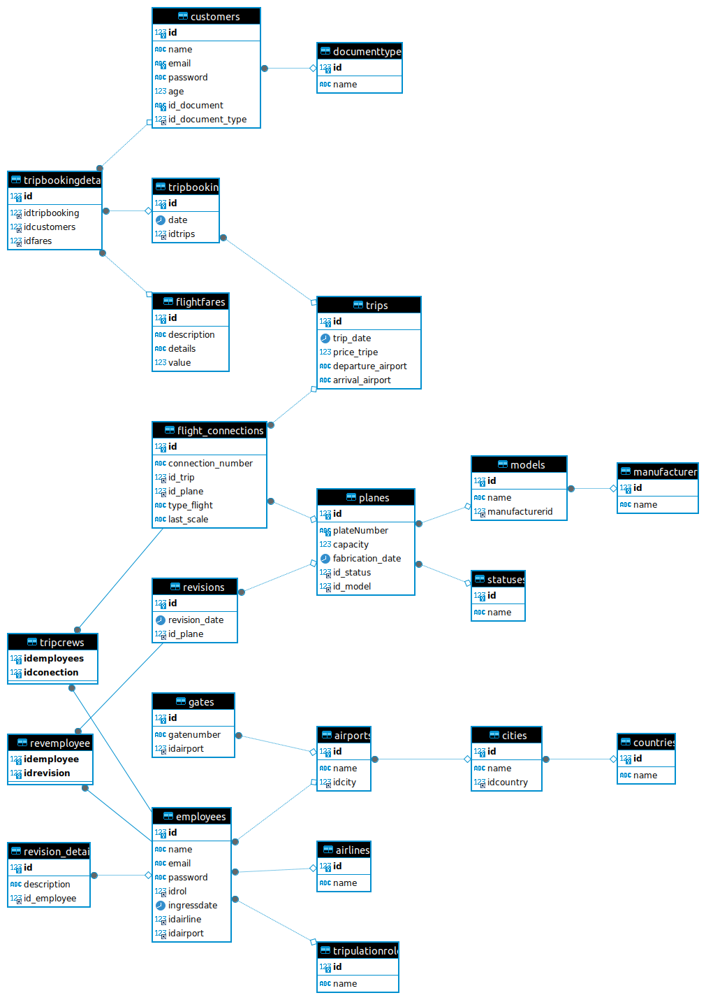

# Proyecto: Sistema de Gestión de Aerolíneas

Autores: Edgar David Albarracín y Jorge Luis Osorio Silva

En este proyecto, presentamos una arquitectura hexagonal y vertical slicing, la cual nos permite organizar y manejar las carpetas y funcionalidades del sistema de manera eficiente y modular.

## Requerimientos de entrega

1. Implementar Arquitectura Hexagonal y Vertical Slicing.
2. Publicar el desarrollo del proyecto en un repositorio.
3. El repositorio debe tener un README donde se expliquen las tecnologías usadas en el desarrollo de la solución.
4. El repositorio debe contener los archivos SQL de creación de la base de datos e inserciones de parámetros necesarias para el funcionamiento de la aplicación.

## Arquitectura del Proyecto

### Estructura de Carpetas

Hemos implementado una estructura de carpetas organizada de la siguiente manera, utilizando un ejemplo con la carpeta de Aerolíneas (airlines):

- **airlines/**: Interfaces de usuario.
  - **application/**: Contiene la lógica de aplicación, coordinando las acciones del dominio.
    - **domain/**: Contiene la lógica de negocio y las reglas del dominio.
      - **model/**: Define las entidades y objetos de valor del dominio.
      - **repository/**: Define las interfaces para acceder a los datos del dominio.
  - **infrastructure/**: Contiene la implementación de servicios y acceso a datos.
    - **in/**: Define las interfaces y adaptadores para entrada de datos.
    - **out/**: Define las interfaces y adaptadores para salida de datos.

Cada componente está separado en tres categorías: aplicación, dominio e infraestructura, cada una conteniendo los elementos necesarios para su correcto funcionamiento.

## Tecnologías Utilizadas

- **Java**: Lenguaje de programación principal.
- **Swing**: Para la interfaz de usuario.
- **MySQL**: Para la base de datos.
- **Maven**: Para la gestión de dependencias.

## Base de Datos

El repositorio contiene los archivos SQL necesarios para la creación de la base de datos y la inserción de datos de parámetros iniciales. Estos archivos se encuentran en la carpeta `sql/`.

## Implementación de la Interfaz de Usuario

Para la interfaz de usuario, hemos utilizado Swing, una biblioteca gráfica para Java, la cual nos permite mostrar las tablas y la visualización de cada una de las consultas a la base de datos de una manera eficiente.

## Dificultades Presentadas

Durante el desarrollo del proyecto, enfrentamos varias dificultades, entre ellas:

- Conexión y consultas a la base de datos.
- Sincronización y ajuste de modelos con los repositorios.
- Mantener una arquitectura hexagonal correctamente, lo cual presentó el mayor desafío.

## Componentes del Proyecto

El sistema gestiona cuatro tipos de usuarios, cada uno con diferentes permisos y funcionalidades:

- **Administrador**: Gestión completa del sistema.
- **Agente de Ventas**: Manejo de reservas y clientes.
- **Técnico**: Mantenimiento y revisiones de aeronaves.
- **Cliente**: Interacción con el sistema para reservas y consultas.

Cada rol está ajustado para tener ciertos permisos y trabajar con partes específicas del sistema.

## Conclusión

El proyecto fue un esfuerzo colaborativo que nos permitió explorar y aplicar la arquitectura hexagonal y vertical slicing de manera práctica. A pesar de las dificultades, logramos implementar un sistema funcional y organizado que puede ser fácilmente mantenido y escalado en el futuro.

